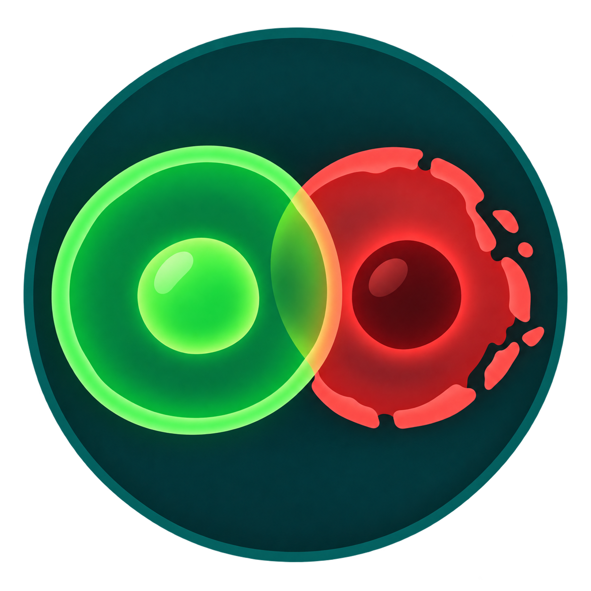
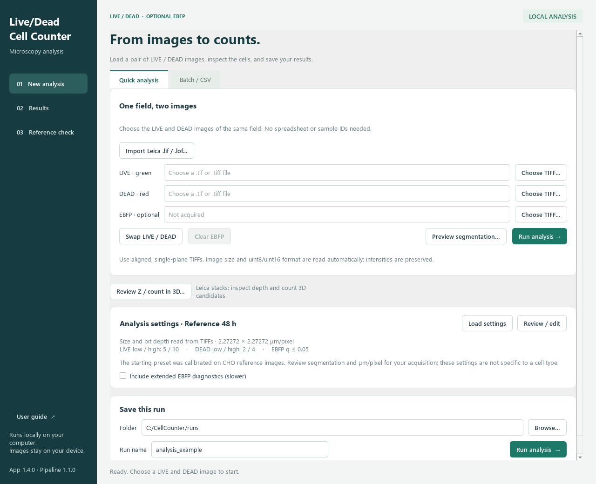
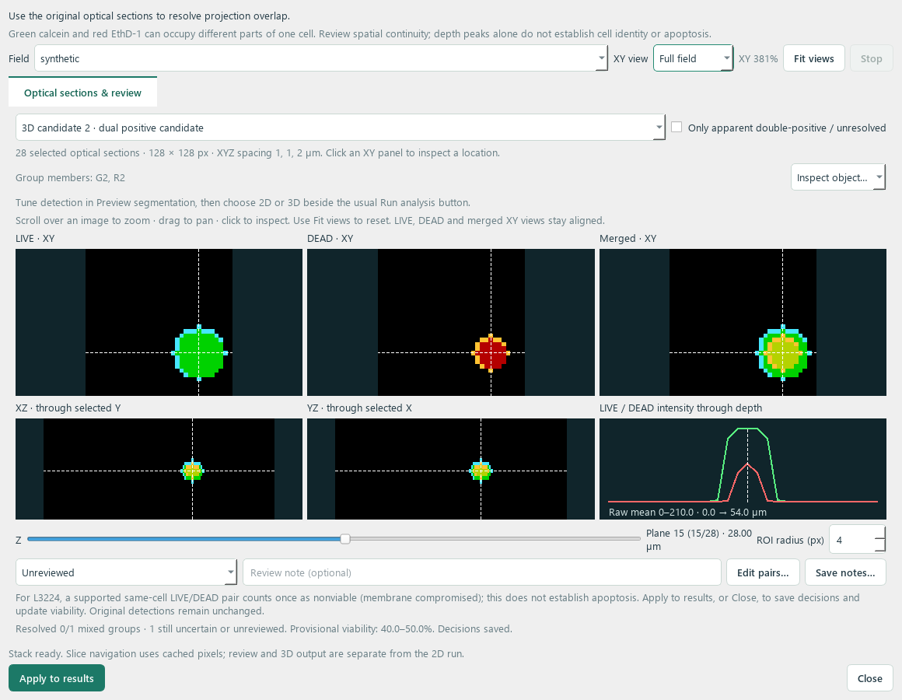

# Live/Dead Cell Counter

A Windows desktop app for counting and visually reviewing cells in paired
LIVE/DEAD fluorescence TIFF images, with optional EBFP analysis.

**[Download the Windows app](https://github.com/bastenefg/cellCount/releases/latest)**
· **[User guide](../APP_GUIDE.md)** · **[Project overview](../START_HERE.md)**

Extract the entire release ZIP and open **Live-Dead Cell Counter.exe**. Python
is included; keep the executable and its `_internal` folder together.

- **Leica SP8 import:** open LIF/LOF files, select channels and a Z slice or
  explicit maximum-intensity projection, and retain acquisition calibration.
- **Review in Z:** scroll synchronized LIVE/DEAD slices, inspect side sections
  and depth profiles, and annotate projected overlaps. Background loading and
  cached stack planes keep navigation responsive.
- **Zoom and pan:** use the mouse wheel over a Z-stack image, drag to pan, or
  click **Fit views** to reset. XY channels stay aligned and zoom persists when
  changing Z slices. Zoom reveals original pixel detail without recounting.
- **One setup for 2D or 3D:** tune the usual segmentation controls on the maximum
  projection, choose the counting dimension, and click **Run analysis**. Both
  modes use the saved settings and open on the standard Results page.
- **3D candidates:** use the original optical sections to distinguish projected
  overlaps, with saved label volumes and explicit unresolved associations.
  Review the completed masks in depth; a projection and a volume can produce
  different detections even with the same thresholds.
- **3D viability and review:** see a provisional viability range, resolve mixed
  candidates in Z, then apply decisions to update counts, CSVs and summary
  figures without repeating segmentation. Reviews reopen automatically and
  can be exported for collaborators.
- **Threshold sliders:** adjust peak/region thresholds while keeping exact
  numeric controls; previews update after releasing the slider.
- **Quick analysis:** select LIVE and DEAD TIFFs without a CSV or sample IDs.
- **Visual review:** compare input images with outlines or masks, zoom, inspect
  individual detections, and tune segmentation settings.
- **Responsive previews:** tested DEAD-threshold edits update in about two
  seconds on the development machine, using full-resolution images.
- **Batch analysis:** process multiple fields and biological replicate groups
  with saved settings, counts, figures and provenance records.
- **Full-field summaries:** save 2D summaries as PNG or SVG and per-field 3D
  summaries as PNG, with the masks and threshold values from that completed run.
  Older runs remain readable without recounting cells.

3D viability assumes each channel object represents one cell and each true
EthD-1-positive cell is nonviable (L3224). A confirmed LIVE/DEAD pair counts once
as nonviable; uncertain groups remain in a scenario range. Resolve all mixed
groups to obtain a single reviewed percentage. Complex groups require explicit
pairs. Original masks and settings remain unchanged. EBFP scoring is available
in 2D; neither mode diagnoses apoptosis.

The repository includes source, tests, reference fixtures, the supplied sample
pair, and validation evidence. Version 1.4.3 passed **271 tests**, including
zoomed coordinates, native pixel detail, synchronized channels, viability
ranges, saved reviews, exact figure panels and both analysis routes. See the
[source validation](../app_validation/release_1.4.3/source_validation.json) and
[zoom workflow check](../app_validation/release_1.4.3/source_zoom_workflow.json).
The synthetic review workflow updated counts and the figure in about **0.2
seconds** per decision on the development machine, without resegmentation. See
the [review workflow check](../app_validation/release_1.4.2/source_viability_workflow.json).
A complete two-channel 25-plane 1024² 3D run took about **13 seconds**, including
worker startup, with warm caches on the development machine. Bounded parallel
processing preserved identical masks and object tables. See the
[workflow check and timing context](../app_validation/release_1.4.1/source_unified_workflow.json).
Earlier [slice-navigation measurements](../app_validation/release_1.4.0/performance_validation.json)
and Leica pixel/reference checks remain available. Timing varies with acquisition,
settings, hardware and other activity; these checks do not establish biological accuracy.

The [original scientific pipeline documentation](../README.md) is preserved.
Its bundled CHO preset is a reference example; review thresholds and pixel
calibration for your acquisition. Software reproducibility does not establish
biological accuracy on a new dataset.

See [START_HERE.md](../START_HERE.md) and [APP_GUIDE.md](../APP_GUIDE.md) for
source setup, rebuilding, validation and licensing notes.
