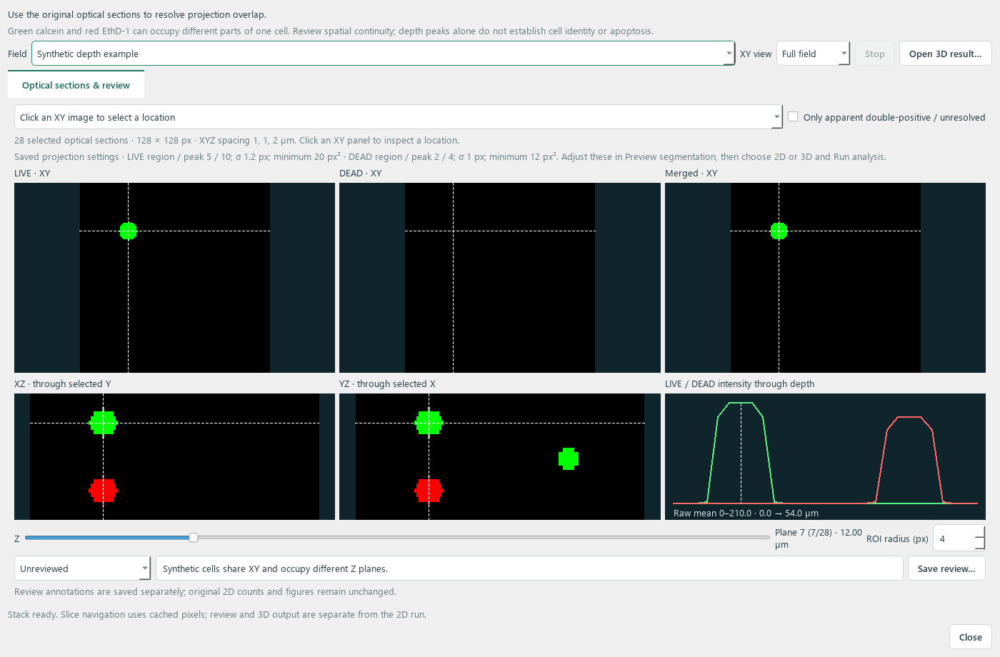

# Live/Dead Cell Counter

A Windows desktop app for counting and visually reviewing cells in paired
LIVE/DEAD fluorescence TIFF images, with optional EBFP analysis.

**[Download the Windows app](https://github.com/bastenefg/cellCount/releases/latest)**
· **[User guide](../APP_GUIDE.md)** · **[Project overview](../START_HERE.md)**

Extract the entire release ZIP and open **Live-Dead Cell Counter.exe**. Python
is included; keep the executable and its `_internal` folder together.

- **Leica SP8 import:** open LIF/LOF files, select channels and a Z slice or
  explicit maximum-intensity projection, and retain acquisition calibration.
- **Review in Z:** scroll synchronized LIVE/DEAD slices, inspect side sections
  and depth profiles, and annotate projected overlaps. Background loading and
  cached stack planes keep navigation responsive.
- **One setup for 2D or 3D:** tune the usual segmentation controls on the maximum
  projection, choose the counting dimension, and click **Run analysis**. Both
  modes use the saved settings and open on the standard Results page.
- **3D candidates:** use the original optical sections to distinguish projected
  overlaps, with saved label volumes and explicit unresolved associations.
  Review the completed masks in depth; a projection and a volume can produce
  different detections even with the same thresholds.
- **Threshold sliders:** adjust peak/region thresholds while keeping exact
  numeric controls; previews update after releasing the slider.
- **Quick analysis:** select LIVE and DEAD TIFFs without a CSV or sample IDs.
- **Visual review:** compare input images with outlines or masks, zoom, inspect
  individual detections, and tune segmentation settings.
- **Responsive previews:** tested DEAD-threshold edits update in about two
  seconds on the development machine, using full-resolution images.
- **Batch analysis:** process multiple fields and biological replicate groups
  with saved settings, counts, figures and provenance records.
- **Full-field summaries:** save 2D summaries as PNG or SVG and per-field 3D
  summaries as PNG, with the masks and threshold values from that completed run.
  Older runs remain readable without recounting cells.

3D results keep green-only, red-only, dual-positive candidates and unresolved
groups separate. EBFP scoring and apparent viability remain features of the
2D workflow; 3D signal overlap needs review before assigning cell identity.

The repository includes source, tests, reference fixtures, the supplied sample
pair, and validation evidence. Version 1.4.1 passed **220 tests**, including shared
thresholds, calibrated depth separation, both analysis routes, saved figures,
cancellation and previous-result compatibility. See the
[source validation](../app_validation/release_1.4.1/source_validation.json).
A complete two-channel 25-plane 1024² 3D run took about **13 seconds**, including
worker startup, with warm caches on the development machine. Bounded parallel
processing preserved identical masks and object tables. See the
[workflow check and timing context](../app_validation/release_1.4.1/source_unified_workflow.json).
Earlier [slice-navigation measurements](../app_validation/release_1.4.0/performance_validation.json)
and Leica pixel/reference checks remain available. Timing varies with acquisition,
settings, hardware and other activity; these checks do not establish biological accuracy.

The [original scientific pipeline documentation](../README.md) is preserved.
Its bundled CHO preset is a reference example; review thresholds and pixel
calibration for your acquisition. Software reproducibility does not establish
biological accuracy on a new dataset.

See [START_HERE.md](../START_HERE.md) and [APP_GUIDE.md](../APP_GUIDE.md) for
source setup, rebuilding, validation and licensing notes.
