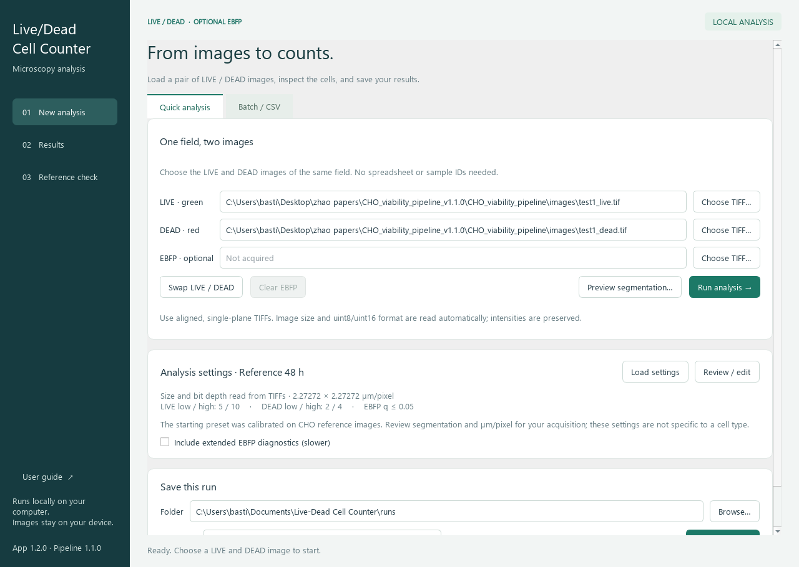

# Live/Dead Cell Counter

A Windows desktop app for counting and visually reviewing cells in paired
LIVE/DEAD fluorescence TIFF images, with optional EBFP analysis.

**[Download the Windows app](https://github.com/bastenefg/cellCount/releases/latest)**
· **[User guide](../APP_GUIDE.md)** · **[Project overview](../START_HERE.md)**

Extract the entire release ZIP and open **Live-Dead Cell Counter.exe**. Python
is included; keep the executable and its `_internal` folder together.

- **Quick analysis:** select LIVE and DEAD TIFFs without a CSV or sample IDs.
- **Visual review:** compare input images with outlines or masks, zoom, inspect
  individual detections, and tune segmentation settings.
- **Responsive previews:** tested DEAD-threshold edits update in about two
  seconds on the development machine, using full-resolution images.
- **Batch analysis:** process multiple fields and biological replicate groups
  with saved settings, counts, figures and provenance records.
- **Figure export:** save the current run's summary directly as a PNG or SVG
  from the Results page.

The repository includes source, tests, reference fixtures, the supplied sample
pair, and validation evidence. All 82 tests passed for version 1.2.0; the
packaged app also reproduced the reference measurements.

The [original scientific pipeline documentation](../README.md) is preserved.
Its bundled CHO preset is a reference example; review thresholds and pixel
calibration for your acquisition. Software reproducibility does not establish
biological accuracy on a new dataset.

See [START_HERE.md](../START_HERE.md) and [APP_GUIDE.md](../APP_GUIDE.md) for
source setup, rebuilding, validation and licensing notes.
